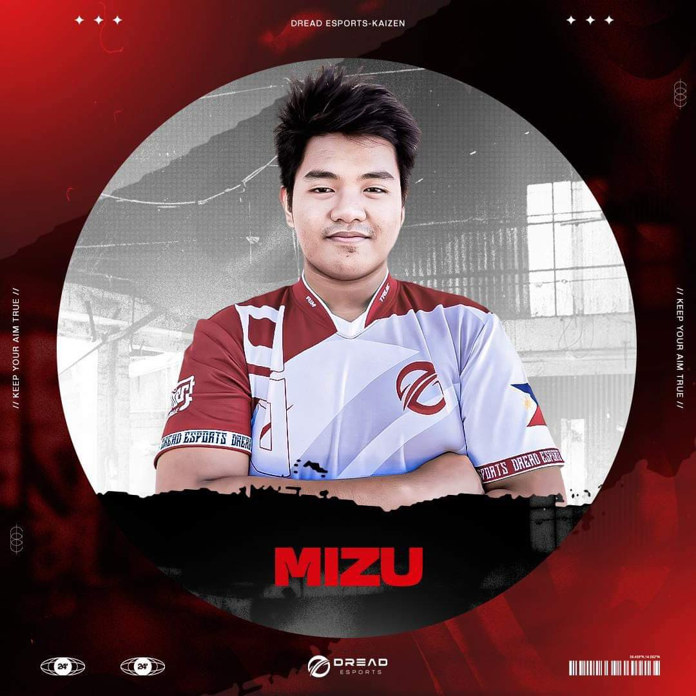

# Project Description
COZYCUP Coffee House is a community-focused café dedicated to serving high-quality, freshly brewed coffee in a cozy and inviting atmosphere. Our mission is to create a space where coffee enthusiasts can relax, socialize, and enjoy expertly crafted beverages. With a commitment to exceptional customer service and a welcoming environment, COZYCUP aims to be the go-to spot for both casual coffee drinkers and passionate aficionados. Whether you're grabbing a quick coffee on the go or settling in for a long, relaxed visit, COZYCUP is the perfect place to unwind and connect with others.  

## Features
* High-Quality Coffee  
* Cozy Atmosphere  
* Diverse Menu  
* Free Wi-Fi  
* Relaxing Environment  

### Screen Captures
  
  
Cozy athmosphere that will make you relax while sipping a cup of coffee.  

    
  
High Quality Coffee made by a certified barista.  

    
  
Pastries that is freshly made to pair with coffee.  
  
  

Our coffee is carefully and skillfully made, So you can Sip, Relax and repeat.  

#### About The Authors
    
 
**John Michael Relova   
202280172@psu.palawan.edu.ph**  
Owner & Founder. Passionate about coffee and community.

 
  
  
**Xyril Francisco  
202280001@psu.palawan.edu.ph**  
Head Barista. Creating the perfect cup of coffee, every time.  

  
  
  <a href="https://www.facebook.com/johnmichael.relova">John Michael Relova</a>  
  <a href="https://www.facebook.com/xyril.francisco.1">Xyril Francisco</a>  

   
  
  <a href="https://github.com/xyrilplayz/collab-namin.git">Github_Collaboration_Repository</a>